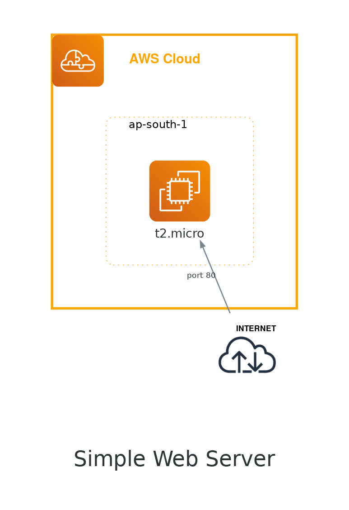

# Terraform AWS Basics

[](https://travis-ci.org/joemccann/dillinger)

## Creation of Simple Webserver using terraform

In this project we will build simple Webserver using Terraform. 
With the help of Terraform and user_data we will install 
HTTP server with custom page. 
After successful terraform apply, 
we should be able to visit VM public IP address 
with our web browser and expect the simple webpage content. 

## Use of python Diagram to draw the Infrastructue. 

Also we will use python Diagram module to draw the cloud system 
architecture in Python code. Below is the Diagram created using python



## 🧰 Languages and Tools


## Deploy Using the Terraform CLI

### Prerequisites 

Create a user in AWS with programmatic access and required permission to deploy the resources. 
After creating the user export below environment variables 

```javascript
export AWS_ACCESS_KEY_ID = ''

export AWS_SECRET_ACCESS_KEY = ''

```
### Clone of the repo

Now, you'll want a local copy of this repo. 
 Clone the repo from github and then go to proper subdirectory

```javascript
git clone 

cd basic_single_node_webserver

```

### Create the Resources and deploy it

Run the following commands

```javascript
terraform init

terraform plan

terraform apply

```
Verify the deployment by navigating to your server address in your preferred browser.

You can also view the public address of the server by using `terraform output`

```sh
<Public IP of the server>:80
```

### Destroy the Deployment

When you no longer need the deployment, you can run this command to destroy the resources

```javascript
terraform destroy

```

## Creating Infrastructure Diagram using python

### Prerequisites 

It requires Python 3.6 or higher, check your Python version first.

It uses Graphviz to render the diagram, so you need to install Graphviz to use diagrams. 

After installing graphviz (or already have it), install the diagrams, Install Diagram module and graphviz.
 
```javascript
sudo apt install graphviz # For Ubuntu

choco install graphviz # For windows user

pip install diagram

```
### Run the script

This will create Image in the same folder from where you are running the code. 

```javascript
python web_diagram.py

```
### 🧾References

https://registry.terraform.io/providers/hashicorp/aws/latest/docs

https://diagrams.mingrammer.com/docs/getting-started/examples

https://graphviz.org/doc/info/attrs.html

## License

[MIT](https://choosealicense.com/licenses/mit/)