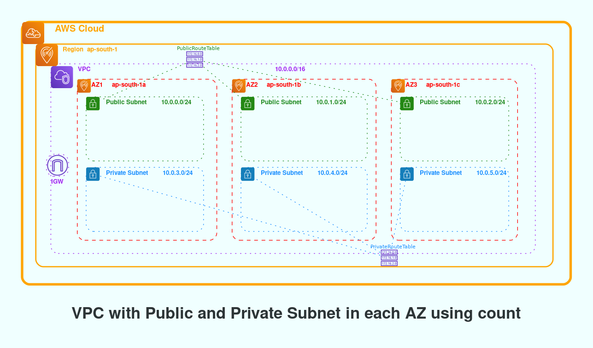
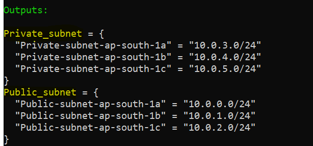
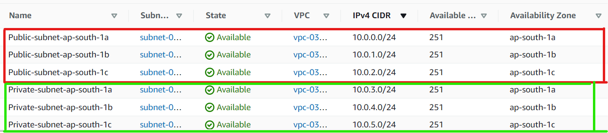

# Terraform AWS Basics
[](https://shields.io/)  ![Terraform](https://img.shields.io/badge/Made%20with-Terraform-purple?style=for-the-badge&logo=data:image/svg%2bxml;base64,PHN2ZyBpZD0iQ2FwYV8xIiBlbmFibGUtYmFja2dyb3VuZD0ibmV3IDAgMCA1MTIgNTEyIiBoZWlnaHQ9IjUxMiIgdmlld0JveD0iMCAwIDUxMiA1MTIiIHdpZHRoPSI1MTIiIHhtbG5zPSJodHRwOi8vd3d3LnczLm9yZy8yMDAwL3N2ZyI+PGc+PHBhdGggZD0ibTM5NS44MiAxODIuNjE2LTE4OC43MiAxODguNzItMTIuOTEgMS43Mi05LjM1IDIwLjU0LTM0LjMxIDM0LjMxLTExLjAxLS43My0xMS4yNSAyMi45OS01Ni40OCA1Ni40OGMtMi45MyAyLjkzLTYuNzcgNC4zOS0xMC42MSA0LjM5cy03LjY4LTEuNDYtMTAuNjEtNC4zOWwtMjIuNjItMjIuNjJoLS4wMWwtMjIuNjItMjIuNjNjLTUuODYtNS44Ni01Ljg2LTE1LjM2IDAtMjEuMjJsNzcuNjMtNzcuNjMgMTYuNi03LjAzIDUuNjYtMTUuMjMgMzQuMzEtMzQuMzEgMTQuODQtNC45MiA3LjQyLTE3LjM0IDE2Ny41Ny0xNjcuNTcgMzMuMjQgMzMuMjR6IiBmaWxsPSIjZjY2Ii8+PHBhdGggZD0ibTM5NS44MiAxMTYuMTQ2djY2LjQ3bC0xODguNzIgMTg4LjcyLTEyLjkxIDEuNzItOS4zNSAyMC41NC0zNC4zMSAzNC4zMS0xMS4wMS0uNzMtMTEuMjUgMjIuOTktNTYuNDggNTYuNDhjLTIuOTMgMi45My02Ljc3IDQuMzktMTAuNjEgNC4zOXMtNy42OC0xLjQ2LTEwLjYxLTQuMzlsLTIyLjYyLTIyLjYyIDMzNC42NC0zMzQuNjR6IiBmaWxsPSIjZTYyZTZiIi8+PHBhdGggZD0ibTUwNi42MSAyMDkuMDA2LTY5LjE0LTY5LjEzIDQzLjA1LTg4LjM4YzIuOC01Ljc1IDEuNjUtMTIuNjUtMi44OC0xNy4xNy00LjUyLTQuNTMtMTEuNDItNS42OC0xNy4xNy0yLjg4bC04OC4zOCA0My4wNS02OS4xMy02OS4xNGMtNC4zNS00LjM1LTEwLjkyLTUuNi0xNi41Ni0zLjE2LTUuNjUgMi40NS05LjIzIDguMDktOS4wNCAxNC4yNGwyLjg2IDkwLjQ1LTg1LjM3IDU3LjgzYy00LjkxIDMuMzItNy40IDkuMjItNi4zNiAxNS4wNCAxLjA0IDUuODMgNS40IDEwLjUxIDExLjE1IDExLjk0bDk2LjYyIDI0LjAxIDI0LjAxIDk2LjYyYzEuNDMgNS43NSA2LjExIDEwLjExIDExLjk0IDExLjE1Ljg3LjE2IDEuNzUuMjMgMi42Mi4yMyA0LjkyIDAgOS42LTIuNDIgMTIuNDItNi41OWw1Ny44My04NS4zNyA5MC40NSAyLjg2YzYuMTQuMTkgMTEuNzktMy4zOSAxNC4yNC05LjA0IDIuNDQtNS42NCAxLjE5LTEyLjIxLTMuMTYtMTYuNTZ6IiBmaWxsPSIjZmFiZTJjIi8+PHBhdGggZD0ibTI5Ni4yNiAyMTUuNzA2IDI0LjAxIDk2LjYyYzEuNDMgNS43NSA2LjExIDEwLjExIDExLjk0IDExLjE1Ljg3LjE2IDEuNzUuMjMgMi42Mi4yMyA0LjkyIDAgOS42LTIuNDIgMTIuNDItNi41OWw1Ny44My04NS4zNyA5MC40NSAyLjg2YzYuMTQuMTkgMTEuNzktMy4zOSAxNC4yNC05LjA0IDIuNDQtNS42NCAxLjE5LTEyLjIxLTMuMTYtMTYuNTZsLTY5LjE0LTY5LjEzIDQzLjA1LTg4LjM4YzIuOC01Ljc1IDEuNjUtMTIuNjUtMi44OC0xNy4xN3oiIGZpbGw9IiNmZDkwMjUiLz48cGF0aCBkPSJtNDY1IDQxNi45NjZjLTI1LjkyIDAtNDcgMjEuMDgtNDcgNDdzMjEuMDggNDcgNDcgNDcgNDctMjEuMDggNDctNDctMjEuMDgtNDctNDctNDd6IiBmaWxsPSIjZmFiZTJjIi8+PHBhdGggZD0ibTEwNCAyOC45NjZoLTEzdi0xM2MwLTguMjg0LTYuNzE2LTE1LTE1LTE1cy0xNSA2LjcxNi0xNSAxNXYxM2gtMTNjLTguMjg0IDAtMTUgNi43MTYtMTUgMTVzNi43MTYgMTUgMTUgMTVoMTN2MTNjMCA4LjI4NCA2LjcxNiAxNSAxNSAxNXMxNS02LjcxNiAxNS0xNXYtMTNoMTNjOC4yODQgMCAxNS02LjcxNiAxNS0xNXMtNi43MTYtMTUtMTUtMTV6IiBmaWxsPSIjZmVkODQzIi8+PHBhdGggZD0ibTIwNy4xIDM3MS4zMzYtMjIuMjYgMjIuMjYtNDUuMzItODcuNjIgMjIuMjYtMjIuMjZ6IiBmaWxsPSIjZmVkODQzIi8+PHBhdGggZD0ibTE4NC44NCAzOTMuNTk2IDIyLjI2LTIyLjI2LTIyLjY2LTQzLjgxLTIyLjI2NSAyMi4yNjV6IiBmaWxsPSIjZmFiZTJjIi8+PHBhdGggZD0ibTE1MC41MyA0MjcuOTA2LTIyLjI2IDIyLjI2LTQ1LjMyLTg3LjYyIDIyLjI2LTIyLjI2eiIgZmlsbD0iI2ZlZDg0MyIvPjxwYXRoIGQ9Im0xMjguMjcgNDUwLjE2NiAyMi4yNi0yMi4yNi0yMi42NTUtNDMuODE1LTIyLjI2IDIyLjI2eiIgZmlsbD0iI2ZhYmUyYyIvPjxjaXJjbGUgY3g9IjE1IiBjeT0iMTE5Ljk2OSIgZmlsbD0iIzVlZDhkMyIgcj0iMTUiLz48Y2lyY2xlIGN4PSIxMjgiIGN5PSIxOTkuOTY5IiBmaWxsPSIjZDU5OWVkIiByPSIxNSIvPjxjaXJjbGUgY3g9IjE5MiIgY3k9IjYzLjk2NCIgZmlsbD0iI2Y2NiIgcj0iMTUiLz48Y2lyY2xlIGN4PSIzMjgiIGN5PSI0MTUuOTY3IiBmaWxsPSIjMzFiZWJlIiByPSIxNSIvPjxjaXJjbGUgY3g9IjQ0MCIgY3k9IjMyNy45NjciIGZpbGw9IiNhZDc3ZTMiIHI9IjE0Ljk5OSIvPjwvZz48L3N2Zz4=) 


## 💥AWS VPC with Public and Private Subnet in each Availablity Zone created using Count

In this project we will build custom VPC with Public and Private Subnets in each Availablity zone without duplicating the code. To avoid duplicating the code, we are making use of Terraform meta-arguments and built-in functions. Specifically, we are using `count` and `cidrsubnet`. The `count`, will generate as many copies of your subnet as you want. `cidrsubnet` calculates a subnet address within given IP network address prefix.

```javascript

cidrsubnet(prefix, newbits, netnum)

```
`prefix` must be given in CIDR notation, as defined in RFC 4632 section 3.1.

`newbits` is the number of additional bits with which to extend the prefix. For example, if given a prefix ending in /16 and a newbits value of 8, the resulting subnet address will have length /24.

`netnum` is a whole number that can be represented as a binary integer with no more than newbits binary digits, which will be used to populate the additional bits added to the prefix.

```javascript

variable "iprange" {
  default = "10.0.0.0/16"
}

output "cidrsubnet" {
  value = "${cidrsubnet(var.iprange,8,1)}"  ==> # Returns 10.0.1.0/24 as CIDR range
}
```

## ✨Use of python Diagram to draw the Infrastructue. 

Also we will use python Diagram module to draw the cloud system 
architecture in Python code. Below is the Diagram created using python




## 🧰 Languages and Tools

  


## Deploy Using the Terraform CLI

### Prerequisites 

Create a user in AWS with programmatic access and required permission to deploy the resources. 
After creating the user export below environment variables 

```javascript
export AWS_ACCESS_KEY_ID = ''

export AWS_SECRET_ACCESS_KEY = ''

```
### Clone of the repo

Now, you'll want a local copy of this repo. 
 Clone the repo from github and then go to proper subdirectory

```javascript
git clone https://github.com/durguupi/terraform_aws.git

cd pub_priv_sub_using_count

```

### Create the Resources and deploy it

Run the following commands

```javascript
terraform init

terraform plan

terraform apply

```

### Destroy the Deployment

When you no longer need the deployment, you can run this command to destroy the resources

```javascript

terraform destroy

```
### Sample ScreenShots

[](screenshots/output1.png) &nbsp;&nbsp;&nbsp;&nbsp; [](screenshots/output2.png)

## 🎨Creating Infrastructure Diagram using python

### Prerequisites 

It requires Python 3.6 or higher, check your Python version first.

It uses Graphviz to render the diagram, so you need to install Graphviz to use diagrams. 

After installing graphviz (or already have it), install the diagrams, Install Diagram module and graphviz.
 
```javascript
sudo apt install graphviz # For Ubuntu

choco install graphviz # For windows user

pip install diagram

```
### Run the script

This will create Image in the same folder from where you are running the code. 

```javascript
cd scripts

python main.py

```
### 🧾References

https://registry.terraform.io/providers/hashicorp/aws/latest/docs

https://diagrams.mingrammer.com/docs/getting-started/examples

https://graphviz.org/doc/info/attrs.html

https://www.terraform.io/language/functions/cidrsubnet

https://www.terraform.io/language/meta-arguments/count

## License  [](https://github.com/Naereen/badges/blob/master/LICENSE)

[MIT](https://choosealicense.com/licenses/mit/)
