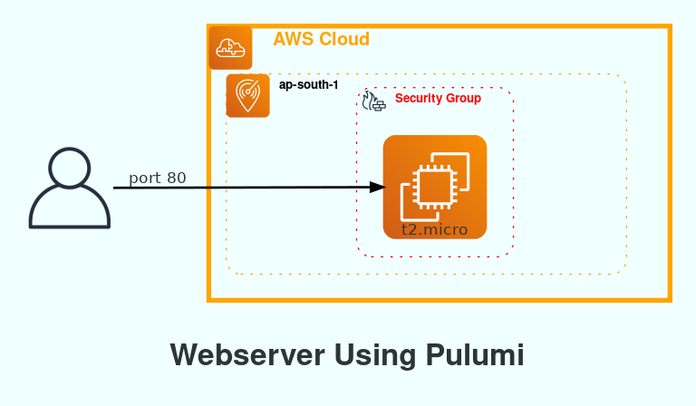
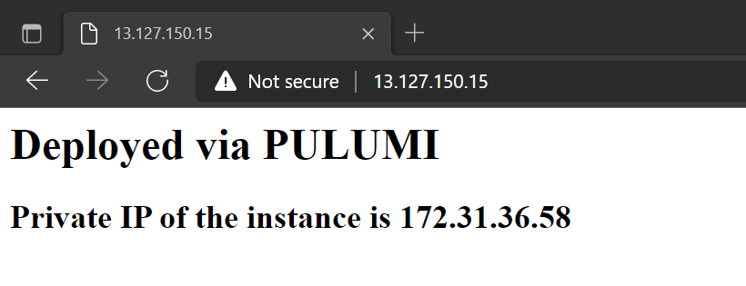

# Pulumi AWS Basics


## Simple Webserver using Pulumi

In this project we will build simple Webserver using Pulumi. 
With the help of Pulumi and user_data we will install 
HTTP server with custom page. 
After successful deployment, 
we should be able to visit VM public IP address 
with our web browser and expect the simple webpage content. 

## Use of python Diagram to draw the Infrastructue. 

Also we will use python Diagram module to draw the cloud system 
architecture in Python code. Below is the Diagram created using python



## 🧰 Languages and Tools

[](pulumi_aws.png)


## Deploy Using the Pulumi CLI

### Prerequisites 
1. [Install Pulumi](https://www.pulumi.com/docs/get-started/install/)
2. [Configure Pulumi for AWS](https://www.pulumi.com/docs/intro/cloud-providers/aws/setup/)
3. [Configure Pulumi for Python](https://www.pulumi.com/docs/intro/languages/python/)

## Clone of the repo
Now, you'll want a local copy of this repo. 
 Clone the repo from github and then go to proper subdirectory

```javascript
git clone 

cd webserver_with_pulumi

```

## Create the Resources and deploy it

1. Create a new stack:

    ```bash
    $ pulumi stack init python-webserver
    ```

2. Set the AWS region:

    ```bash
    $ pulumi config set aws:region ap-south-1
    ```

3. Run `pulumi up` to preview and deploy changes:

    ```bash
    $ pulumi up
    Previewing stack 'python-webserver'
    Previewing changes:
    
     Type                      Name                        Plan
    +   pulumi:pulumi:Stack       webserver-python-webserver  create
    +   ├─ aws:ec2:SecurityGroup  webserver-secgrp            create
    +   └─ aws:ec2:Instance       webserver-www               create


    ...

    Do you want to proceed? yes
    Updating stack 'python-webserver'
    Performing changes:

    #: Resource Type          Name                                   Status     Extra Info
    1: pulumi:pulumi:Stack    webserver-py-python-webserver          + created  
    2: aws:ec2:SecurityGroup  web-secgrp                             + created  
    3: aws:ec2:Instance       web-server-www                         + created  

    Outputs:
        publicHostName: "ec2-13-127-150-15.ap-south-1.compute.amazonaws.com"
        publicIp      : "13.127.150.15"

    Resources:
        + 3 created

    Duration: 49s
    ```
4. View the host name and IP address of the instance via `stack output`:

    ```bash
    Please choose a stack: python-webserver
    Current stack outputs (2):
        OUTPUT          VALUE
        publicHostName  ec2-13-127-150-15.ap-south-1.compute.amazonaws.com
        publicIp        13.127.150.15
    ```

5.  Verify that the EC2 instance exists, by either using the AWS Console or running `aws ec2 describe-instances`.

6. Verify the deployment by navigating to your server address in your preferred browser.



## Clean up

To clean up resources, run `pulumi destroy` and answer the confirmation question at the prompt.

To remove the stack completely run `pulumi rm python-webserver` . This removes history and configuration associated with the stack

## Creating Infrastructure Diagram using python

## Prerequisites 
It requires Python 3.6 or higher, check your Python version first.

It uses Graphviz to render the diagram, so you need to install Graphviz to use diagrams. 

After installing graphviz (or already have it), install the diagrams, Install Diagram module and graphviz.
 
```javascript
sudo apt install graphviz # For Ubuntu

choco install graphviz # For windows user

pip install diagram

```
## Run the script
This will create Image in the same folder from where you are running the code. 

```javascript
python web_diagram.py

```
## References

https://registry.terraform.io/providers/hashicorp/aws/latest/docs

https://diagrams.mingrammer.com/docs/getting-started/examples

https://graphviz.org/doc/info/attrs.html

## License
[MIT](https://choosealicense.com/licenses/mit/)


